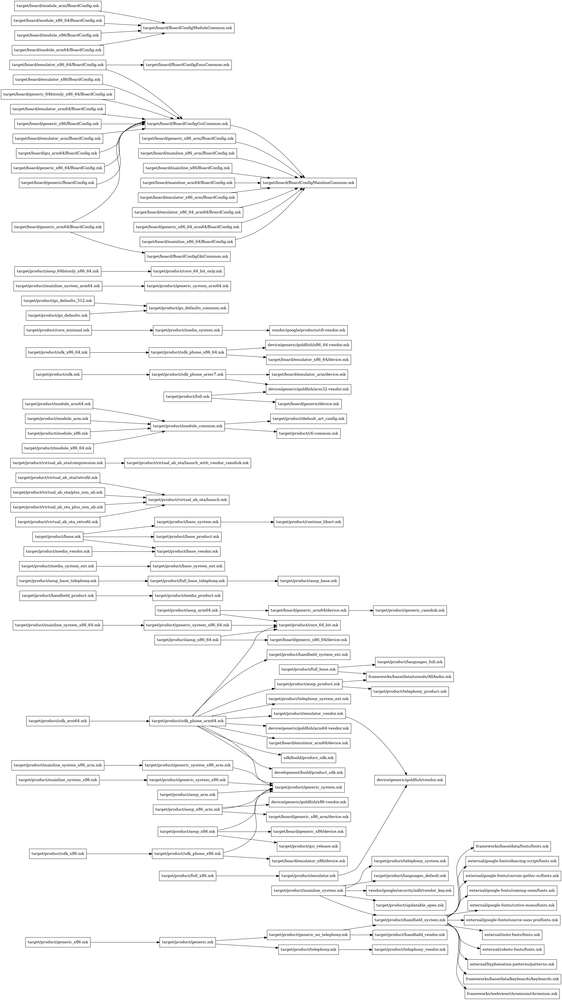

# AOSP Build Include Graph

<!--For full documentation visit [mkdocs.org](https://www.mkdocs.org).-->


In AOSP Project one of biggest thing is the build system, it is using soong, ninja, kati, blueprint etc., During the build, the **AndroidProducts.mk** and **BoardConfig.mk** files get read by the build system to configure it. files get read by the build system to configure it. When creating your own build, you presumably include fragments found in build/make/target to set up standard apps. However, if you look into it, where to start isn't clear. At least it wasn't to me. Reading the mk files gets unwieldy with all the indirection so I created a small script to graph out how things are included.

<figure markdown>
  { width="750" }
</figure>

Here, it's easier to see which parts are at the top of the tree and how one include affects another.

## Python Script to Create the Graph 

```py title="build_include.py" linenums="1"

#!/usr/bin/env python
# Convert AOSP build include egrep output to visual graph via graphviz
# ---
# In aosp/build/make/, run something like:
#  egrep -R '(inherit|include)' target/ | python3 build_include.py | dot -Tpng > build-includes.png

import re
import sys

lines = sys.stdin.readlines()

nodes = {}
pairs = []
for l in lines:
    l = l.replace("$(SRC_TARGET_DIR)", "target")
    l = l.replace("build/make/target", "target")
    m = re.match('^([-\.\w/_]+):(([\s ,-]|include|\$\(call|inherit|product|if|exists))*([-\.\w/_]+\.mk)\)?', l)
    if m:
        mfile = m.group(1)
        minclude = m.group(4)
        for k in (mfile,minclude):
            if not k in nodes:
                nodes[k] = len(nodes)
                pairs.append((mfile,minclude))
            else:
                sys.stderr.write('Dropped line: {}\n'.format(l))

print("strict digraph includes {")
print("\trankdir=LR")
for (k,v) in nodes.items():
    print("\tn{} [label=\"{}\" shape=box]".format(v, k))

for (mfile,minclude) in pairs:
	print("\tn{} -> n{}".format(nodes[mfile], nodes[minclude]))
    

print("}")

```

## How to Run the Script

In Your AOSP source code goto ***build/make/*** directory and save this script in the same location as **build_include.py** and execute the following command.

```sh
egrep -R '(inherit|include)' target/ | python3 build_include.py | dot -Tpng > build-includes.png
```

By running the above script one **build-includes.png** file will get saved in the current directory.

if you want to save as pdf you run the below command.
```sh
egrep -R '(inherit|include)' target/ | python3 build_include.py | dot -Tpdf > build-includes.pdf
```

## Python Script for Any Folder in the AOSP Source tree

```py title="build_include.py" linenums="1"
#!/usr/bin/env python
# Convert AOSP build include egrep output to visual graph via graphviz
# ---
# In device/google/, run something like:
#  egrep -R '(inherit|include)' * | python3 build_include.py | dot -Tpng > build-includes.png

import os
import re
import sys

lines = sys.stdin.readlines()

nodes = {}
pairs = []
for l in lines:
    l = l.replace("$(SRC_TARGET_DIR)", "target")
    l = l.replace("build/make/target", "target")
    m = re.match('^([-\.\w/_]+):(([\s ,-]|include|\$\(call|inherit|product|if|exists))*([-\.\w/_]+\.mk)\)?', l)
    if m:
        mfile = os.path.join(os.getcwd(), m.group(1))
        minclude = os.path.join(os.getcwd(), m.group(4))
        for k in (mfile, minclude):
            if not k in nodes:
                nodes[k] = len(nodes)
                pairs.append((mfile, minclude))
            else:
                sys.stderr.write('Dropped line: {}\n'.format(l))

print("strict digraph includes {")
print("\trankdir=LR")
for (k, v) in nodes.items():
    label = k.replace(os.getcwd() + "/", "")
    print("\tn{} [label=\"{}\" shape=box]".format(v, label))

for (mfile, minclude) in pairs:
    print("\tn{} -> n{}".format(nodes[mfile], nodes[minclude]))

print("}")
```

## Run the script with following command

Run the script with following command

```sh
egrep -R '(inherit|include)' . | python3 build_include.py | dot -Tpng > build-includes.png
```
> below command is for to generate the output in pdf format.

```
egrep -R '(inherit|include)' . | python3 build_include.py | dot -Tpdf > build-includes.pdf
```

<span style="color:Red">NOTE: ***Replace the `.` with your desired path in which you want to create the graph of all mk files.***</span>


<!-- === "ranjith"
    ranjith
=== "ram"
    ram

=== "Tab 1"
    Some texts

    === "Tab A"
        Text A

    === "Tab B"
        Text B

=== "Tab 2"
    Some other texts -->
<!--  -->

<!--  -->

<!-- dot -Tpdf -Nshape=box -o out/products.pdf out/products.dot -->


<!-- 
## Commands

* `mkdocs new [dir-name]` - Create a new project.
* `mkdocs serve` - Start the live-reloading docs server.
* `mkdocs build` - Build the documentation site.
* `mkdocs -h` - Print help message and exit.

## Project layout

    mkdocs.yml    # The configuration file.
    docs/
        index.md  # The documentation homepage.
        ...       # Other markdown pages, images and other files. 
-->
